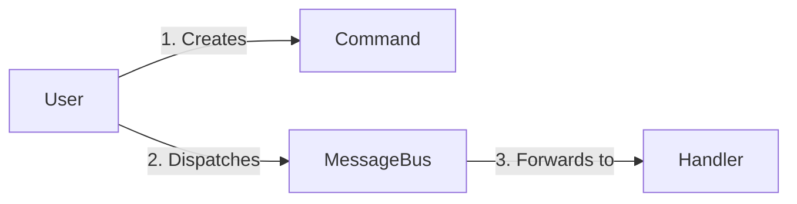
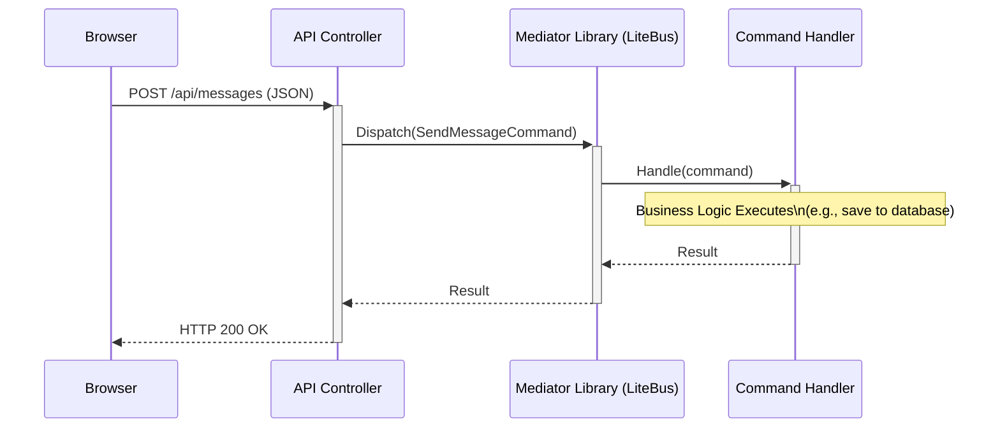

# From Console to Web: Mapping CQRS Concepts
How our User and MessageBus examples fit into a real Web Application.

---

## Recap: Our Console Application
In our C# example, the flow was simple and self-contained.

- A User object initiated an action.
- It created a SendMessageCommand object to represent its intent.
- It gave the command to the MessageBus to handle the logic.



---

## The Big Question: Where do these fit in a web app?
How do these abstract ideas map to the concrete parts of a web application that handles requests from a user's browser?

---

## The User is the API Controller
The User object, which starts the action, becomes the API Controller. It's the front door for all incoming web requests.

Its only jobs are:
- Receive an HTTP request (e.g., POST /api/messages).
- Validate the input and package it into a Command.
- Dispatch the Command to the MessageBus.
- Return an HTTP response (200 OK).

It contains **NO business logic**.

---

## User becomes Controller: The Code
Notice the controller only knows about the bus. It has no idea how the message is handled.

```csharp
// Filename: MessagesController.cs

[ApiController]
[Route("api/[controller]")]
public class MessagesController : ControllerBase
{
    // The bus is injected via Dependency Injection
    private readonly IMessageBus _bus;

    public MessagesController(IMessageBus bus)
    {
        _bus = bus;
    }

    [HttpPost]
    public IActionResult SendMessage([FromBody] MessageInputModel input)
    {
        // 1. Create the command from the web request
        var command = new SendMessageCommand(User.Identity.Name, input.Message);

        // 2. Dispatch it and forget the details
        _bus.Dispatch(command);

        // 3. Return a success response
        return Ok("Message sent successfully.");
    }
}
```

---

## The MessageBus is a Mediator Library
You don't write the MessageBus yourself. You use a powerful, battle-tested NuGet package.

**Examples:** LiteBus or MediatR

This library acts as the smart "plumbing" in your application.

- It's configured at startup to know which Handler processes which Command.
- When you call `bus.Dispatch(command)`, it finds the correct handler automatically.
- It creates the handler with all its dependencies (like a database connection) and executes it.

---

## The Full Web Request Flow
Here's how all the pieces connect for a single web request.



---

## Why Bother? The Benefits of This Pattern
This isn't just for complexity's sake. It creates a much better application.

- **Separation of Concerns:** Controllers handle HTTP. Handlers handle business logic. Clean and simple.
- **High Testability:** You can unit-test a CommandHandler in complete isolation, without needing a web server.
- **Maintainability:** Need to change how messages are sent? You only touch one file: the SendMessageCommandHandler.
- **Clarity:** The code's intent is obvious. SendMessageCommand does exactly what it says.

---

## Summary
- **User ➡️ API Controller**: The part that receives the initial request.
- **MessageBus ➡️ Mediator Library (LiteBus)**: The plumbing that connects requests to logic.

This CQRS-style approach is a foundational pattern for building clean, robust, and scalable web applications.